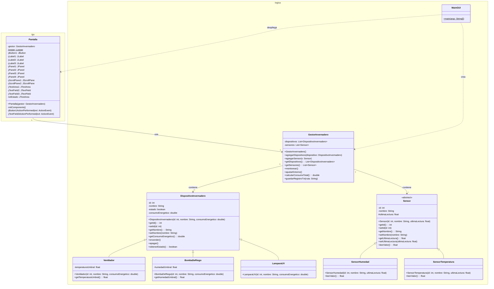

```mermaid
classDiagram

namespace logica {
    class MainGUI {
        +main(args: String[])$
    }

    class GestorInvernadero {
        -dispositivos: List~DispositivoInvernadero~
        -sensores: List~Sensor~
        +GestorInvernadero()
        +agregarDispositivos(dispositivo: DispositivoInvernadero)
        +agregarSensor(s: Sensor)
        +getDispositivos(): List~DispositivoInvernadero~
        +getSensores(): List~Sensor~
        +monitorear()
        +ajustarEntorno()
        +calcularConsumoTotal(): double
        +guardarRegistroTxt(ruta: String)
    }

    class DispositivoInvernadero {
        -id: int
        -nombre: String
        -estado: boolean
        -consumoEnergetico: double
        +DispositivoInvernadero(id: int, nombre: String, consumoEnergetico: double)
        +getId(): int
        +setId(id: int)
        +getNombre(): String
        +setNombre(nombre: String)
        +getConsumoEnergetico(): double
        +encender()
        +apagar()
        +obtenerEstado(): boolean
    }

    class Ventilador {
        -temperaturaUmbral: float
        +Ventilador(id: int, nombre: String, consumoEnergetico: double)
        +getTemperaturaUmbral(): float
    }

    class BombaDeRiego {
        -humedadUmbral: float
        +BombaDeRiego(id: int, nombre: String, consumoEnergetico: double)
        +getHumedadUmbral(): float
    }

    class LamparaUV {
        +LamparaUV(id: int, nombre: String, consumoEnergetico: double)
    }

    class Sensor {
        <<abstract>>
        -id: int
        -nombre: String
        #ultimaLectura: float
        +Sensor(id: int, nombre: String, ultimaLectura: float)
        +getId(): int
        +setId(id: int)
        +getNombre(): String
        +setNombre(nombre: String)
        +getUltimaLectura(): float
        +setUltimaLectura(ultimaLectura: float)
        +leerValor(): float*
    }

    class SensorHumedad {
        +SensorHumedad(id: int, nombre: String, ultimaLectura: float)
        +leerValor(): float
    }

    class SensorTemperatura {
        +SensorTemperatura(id: int, nombre: String, ultimaLectura: float)
        +leerValor(): float
    }
}

namespace igu {
    class Pantalla {
        -gestor: GestorInvernadero
        -logger: Logger$
        -jButton1: JButton
        -jLabel1: JLabel
        -jLabel2: JLabel
        -jLabel3: JLabel
        -jPanel1: JPanel
        -jPanel2: JPanel
        -jPanel3: JPanel
        -jPanel4: JPanel
        -jScrollPane1: JScrollPane
        -jScrollPane2: JScrollPane
        -jTextArea1: JTextArea
        -jTextField2: JTextField
        -jTextField3: JTextField
        -txtEstado: JTextArea
        +Pantalla(gestor: GestorInvernadero)
        -initComponents()
        -jButton1ActionPerformed(evt: ActionEvent)
        -jTextField3ActionPerformed(evt: ActionEvent)
    }
}

%% ---- RELACIONES Y DEPENDENCIAS ----

%% Herencia de Dispositivos
DispositivoInvernadero <|-- Ventilador
DispositivoInvernadero <|-- BombaDeRiego
DispositivoInvernadero <|-- LamparaUV

%% Herencia de Sensores
Sensor <|-- SensorHumedad
Sensor <|-- SensorTemperatura

%% Asociaciones del Gestor (Agregación)
GestorInvernadero "1" --> "*" DispositivoInvernadero : contiene
GestorInvernadero "1" --> "*" Sensor : contiene

%% Relaciones de la GUI e inicio
Pantalla "1" --> "1" GestorInvernadero : usa
MainGUI ..> GestorInvernadero : crea
MainGUI ..> Pantalla : despliega
```
## Documentación

[ Clic aquí para ver la Especificación Técnica del Proyecto](./documentos/documentoProyPOO.pdf)
